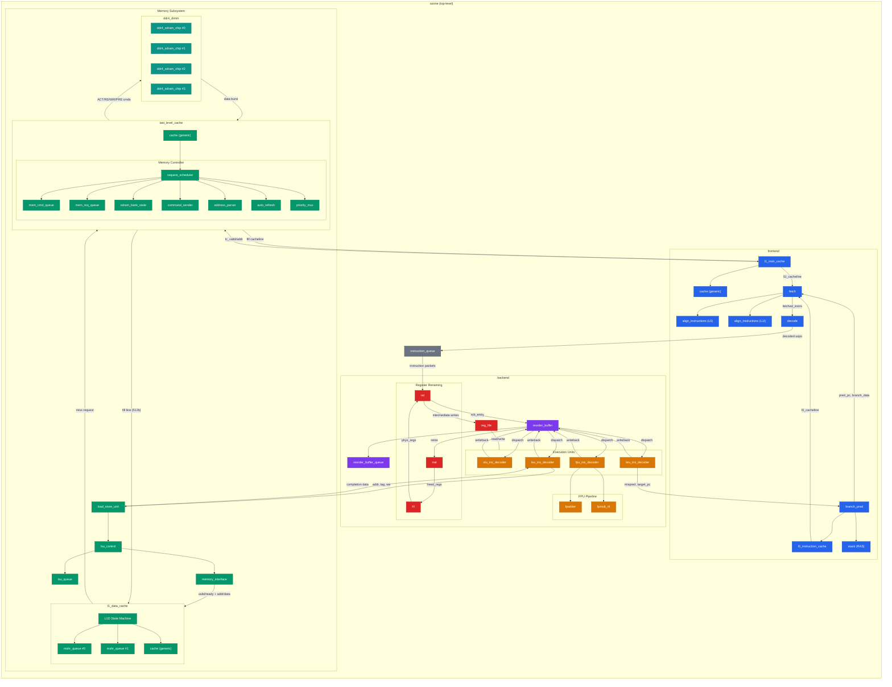

# Ozone OOO CPU - Module Topology

## Mermaid Diagram

Paste the code block below into https://mermaid.live or any Mermaid renderer.

## Module Summary Table

| Subsystem | Module | File | Key Role |
|-----------|--------|------|----------|
| **Top** | `ozone` | `src/ozone.sv` | Top-level: instantiates frontend, IQ, backend, LSU, L1D |
| **Frontend** | `frontend` | `src/frontend/frontend.sv` | Wraps fetch pipeline |
| | `branch_pred` | `src/frontend/branch_pred.sv` | GHR+PHT predictor, owns L0 and RAS |
| | `l0_instruction_cache` | `src/frontend/cache/l0_instruction_cache.sv` | L0 I-cache (private to BP) |
| | `l1_instr_cache` | `src/frontend/cache/l1_instr_cache.sv` | L1 I-cache, wraps generic `cache` |
| | `fetch` | `src/frontend/fetch.sv` | Aligns cachelines into instruction bundles |
| | `decode` | `src/frontend/decode.sv` | Cracks instructions into micro-ops |
| | `align_instructions` | `src/frontend/fetch.sv` | Extracts instructions from cacheline by offset |
| | `stack` (RAS) | `src/util/stack.sv` | Return Address Stack for call/ret prediction |
| **IQ** | `instruction_queue` | `src/util/instr-queue.sv` | FIFO bridging frontend decode to backend RAT |
| **Backend** | `backend` | `src/backend/backend.sv` | Wraps rename, ROB, exec units, regfile |
| | `rat` | `src/backend/registers/rat.sv` | Register Allocation Table (arch -> phys mapping) |
| | `rrat` | `src/backend/registers/rrat.sv` | Retirement RAT (committed mappings) |
| | `frl` | `src/backend/registers/frl.sv` | Free Register List (circular queue) |
| | `reg_file` | `src/backend/registers/reg_file.sv` | Physical register file (16R/8W ports) |
| | `reorder_buffer` | `src/backend/insn_ds/reorder_buffer.sv` | ROB: tracks in-flight insns, dispatches, retires |
| | `reorder_buffer_queue` | `src/backend/insn_ds/reorder_buffer.sv` | Circular queue backing the ROB |
| | `alu_ins_decoder` | `src/backend/exec/alu_ins_decoder.sv` | ALU: combinational execute + writeback |
| | `fpu_ins_decoder` | `src/backend/exec/fpu_ins_decoder.sv` | FPU decoder: coordinates adder + multiplier |
| | `fpadder` | `src/fpu/fpadder.sv` | IEEE 754 FP add/sub (multi-cycle) |
| | `fpmult_rtl` | `src/fpu/fpmult.sv` | IEEE 754 FP multiply (multi-cycle, shift-add) |
| | `lsu_ins_decoder` | `src/backend/exec/lsu_ins_decoder.sv` | LSU decoder: bridges ROB dispatch to memory |
| | `bru_ins_decoder` | `src/backend/exec/bru_ins_decoder.sv` | Branch unit: resolves branches, feeds back |
| **Memory** | `load_store_unit` | `mem/src/load_store_unit.sv` | LSU: queues + interfaces with L1D |
| | `lsu_control` | `mem/src/load_store_unit.sv` | LSU orchestration |
| | `lsu_queue` | `mem/src/load_store_unit.sv` | Pending LD/ST queue |
| | `memory_interface` | `mem/src/load_store_unit.sv` | L1D protocol interface |
| | `l1_data_cache` | `mem/src/l1_data_cache.sv` | L1D: 3-way SA, 1536B, non-blocking, 2 MSHRs |
| | `mshr_queue` | `mem/src/l1_data_cache.sv` | MSHR entry queue (16 entries each) |
| | `cache` (generic) | `mem/src/cache.sv` | Reusable cache storage (used by L1I, L1D, LLC) |
| | `last_level_cache` | `mem/src/last_level_cache.sv` | LLC: 8-way SA, 16KB, embeds DRAM controller |
| | `request_scheduler` | `mem/src/mem_control/mem_scheduler.sv` | DRAM request scheduling (row-buffer aware) |
| | `command_sender` | `mem/src/mem_control/comb_util.sv` | Formats DDR4 commands |
| | `address_parser` | `mem/src/mem_control/comb_util.sv` | Physical addr -> row/bank/col |
| | `sdram_bank_state` | `mem/src/mem_control/bank_state.sv` | Per-bank FSM tracking |
| | `auto_refresh` | `mem/src/mem_control/auto_refresh.sv` | JEDEC refresh scheduling |
| | `mem_cmd_queue` | `mem/src/mem_control/req_queue.sv` | Command queue to DRAM |
| | `mem_req_queue` | `mem/src/mem_control/req_queue.sv` | Request tracking queue |
| | `priority_mux` | `mem/src/priority_mux.sv` | Priority arbitration |
| **DRAM** | `ddr4_dimm` | `mem/src/ddr4_dimm.sv` | DIMM model (4 chips) |
| | `ddr4_sdram_chip` | `mem/src/ddr4_dimm.sv` | Individual DRAM chip with bank FSM |

## Architecture Quick Facts

- **4-wide superscalar** (up to 4 instructions decoded/dispatched per cycle)
- **4 functional units**: ALU (1-cycle), FPU (multi-cycle), BRU (1-cycle), LSU (variable)
- **Out-of-order execution** via ROB with dispatch-on-ready scheduling
- **Register renaming**: RAT + RRAT + FRL cycle (allocate on decode, free on retire)
- **Physical register file**: ~64 regs, 16 read ports (4 FUs x 4 operands), 8 write ports
- **2-level I-cache**: L0 (private to branch predictor) + L1I (generic cache)
- **Branch prediction**: GHR + PHT pattern history table, Return Address Stack
- **3-level data memory**: L1D (3-way, 1536B, 2 MSHRs) -> LLC (8-way, 16KB) -> DDR4
- **DDR4 DRAM**: Modeled with real timing (CAS=22, tRCD=8, tRP=5), 4-chip DIMM, auto-refresh
- **Non-blocking L1D**: MSHRs enable secondary miss coalescing and store-to-load forwarding
- **Write-back policy**: Dirty lines evicted on replacement, not written through
- **NINE inclusion**: Non-inclusive non-exclusive between L1D and LLC
